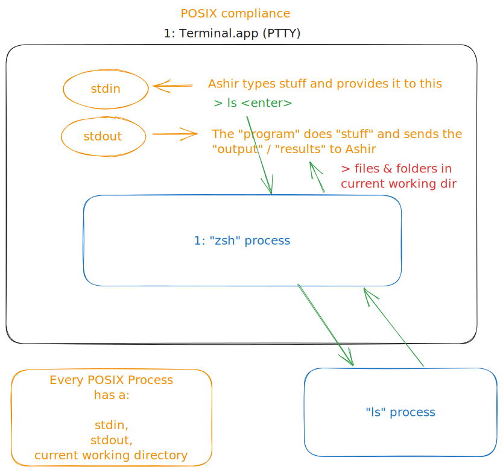

# onboarding

I am glad that you are excited about the project. It's very retro, kinda like 8-bit video games
meets GUI apps meets the terminal 😊.

Rust is a really good programming language (it's not perfect). I think there will be a solid future
for it. Its biggest selling point is memory safety (vs C/C++) and performance (comparable to C/C++).
So it's a systems level language that kind of looks like JS 😃. It was made by Mozilla so the
connection to the web & browsers & JS is very much there.

## Getting started learning Rust

If you'd like to take a look at Rust, here are some great starting points.

- [Rust book](https://rust-book.cs.brown.edu/) (experimental & enhanced version of the Rust book)
- Rustlings: You can go the JetBrains IDE route or terminal based
  - [JetBrains IDE route](https://plugins.jetbrains.com/plugin/16631-learn-rust/)
  - [Terminal & your favorite editor](https://github.com/rust-lang/rustlings)
- [Rust language basics](https://www.youtube.com/playlist?list=PLP2yfE2-FXdQmXLvrQ5QN64enbF_KCYQW)

## Installing Rust toolchain and IDE on your machine

- [Install Rust](<[https://www.rust-lang.org/tools/install](https://www.rust-lang.org/learn/get-started)>)
- [Install VSCode](https://code.visualstudio.com)
  - [Vscode + Rust analyzer](https://code.visualstudio.com/docs/languages/rust)
  - When you open the `r3bl_rs_utils` repo in VSCode it will ask you to install some extensions that
    are recommended. Please do this as it will make your development experience much nicer!

## TUI concepts and Unix terminal concepts

Here is the source file for this drawing:
[excalidraw diagram](docs/terminal-overview-posix.excalidraw).

Here are some great YT video playlists to learn Rust & Text User Interface (TUI) concepts.

- [Working w/ Text User Interfaces intro](https://www.youtube.com/playlist?list=PLP2yfE2-FXdQw0I6O4YdIX_mzBeF5TDdv)
- [Simple layout management for Text User Interfaces](https://www.youtube.com/playlist?list=PLkkNzJtrmgs1ISu3407av-QhocYZAduYv)
- [Deep dive into Unix shells, ptys, etc (the raw underlying OS functions that we use to generate TUIs)](https://www.youtube.com/playlist?list=PLFAC320731F539902)
- [POSIX](https://en.wikipedia.org/wiki/POSIX)
- [PTTY](https://en.wikipedia.org/wiki/Pseudoterminal)
- ANSI:
  - [Escape codes](https://notes.burke.libbey.me/ansi-escape-codes/)
  - [ANSI 256 colors](https://www.ditig.com/256-colors-cheat-sheet)
  - [ANSI color escape sequences](https://stackoverflow.com/questions/4842424/list-of-ansi-color-escape-sequences)

## Learning Rust

- https://developerlife.com/2022/03/02/rust-grep-cli-app/
  - Build a command line interface application “grep” and use this tutorial to get started.
  - We can work on this application over the time of your internship and make it “real” and add lots
    of features to it that the real “grep” program has today. These include:
    - Command line arguments using the clap Rust crate.
    - Implementing the ability to support unix “pipes”, eg: “ls | grep foo”
- https://github.com/r3bl-org/address-book-with-redux-tui
  - This is a pedagogical example to help you understand Rust memory management and mutation along
    w/ Redux.
  - You can even work on implementing a TUI interface on top of this after you get comfortable with
    it to get a handle on the TUI library itself.
- https://doc.rust-lang.org/stable/book/ch00-00-introduction.html
  - This is the Rust book that can be a handy reference on your journey of learning Rust.

## Getting started w/ the r3bl_tui crate

- https://github.com/r3bl-org/r3bl_rs_utils/tree/main/tui#run-the-demo-locally
  - Follow the instructions here to get the repo cloned on your computer.
  - Install fish using `brew install fish` so that you can run the .fish scripts in the repo. If you
    are on Windows, you might first need to install WSL2 and setup a Ubuntu VM in order to get this
    code running in that environment. Although you could just look inside the .fish scripts and type
    those commands in Windows or an environment that doesn't support fish.
- Go through the demos and make sure you run them.
- Go through the README and let me know if things are missing or if they need better explanations.
  Here are some issues to take a look at: - https://github.com/r3bl-org/r3bl_rs_utils/issues/86 -
  https://github.com/r3bl-org/r3bl_rs_utils/issues/102 -
  https://github.com/r3bl-org/r3bl-cmdr/issues/23 -
  https://github.com/r3bl-org/r3bl_rs_utils/issues/87 -
  https://github.com/r3bl-org/r3bl_rs_utils/issues/85
